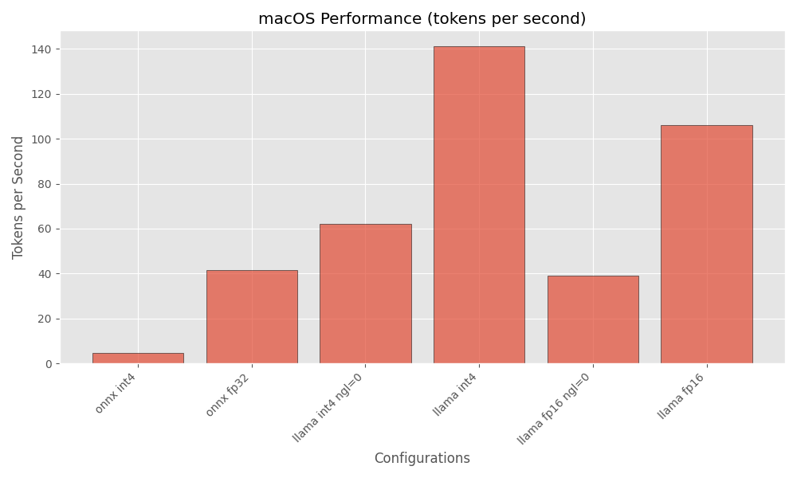
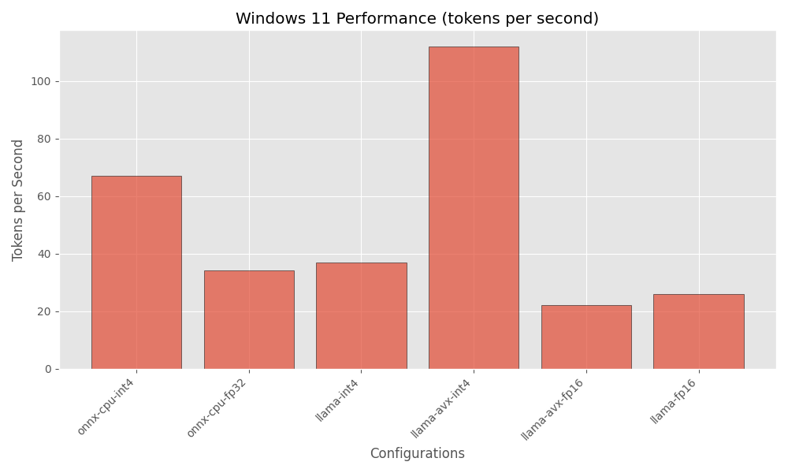

# Onnxruntime vs Llama.cpp

Models: 

- Qwen2.5-0.5B-Instruct int4 or fp32 for onnxruntime
- Qwen2.5-0.5B-Instruct GGUF q4_0 for llama.cpp

Hardware Specs:

- Apple M1 Pro 32GB
- Windows 11 AMD Ryzen Threadripper PRO 16 Cores 128G RAM

Software:

- onnxruntime-genai built from main branch 
- llama.cpp cli version 4113 

### macOS

- onnx int4 - **4.85 tokens/s**
- onnx fp16: FAILS
- onnx fp32 - **41.46 tps** 
- llama int4 ngl=0 - **62 tokens/s**
- llama int4 - **141 tokens/s**
- llama fp16 ngl=0 - **39 tokens/s**
- llama fp16 - **106 tokens/s**

### Windows 11 (CPU)

- onnx int4 - **67 tokens/s**
- onnx fp16 - FAILS
- onnx fp32 - **34 tokens/s**
- llama non-avx int4 - **37 tokens/s**
- llama avx - int4 - **112 tokens/s**
- llama avx512 - int4 FAILED
- llama avx - fp16 **22 tokens/s**
- llama non-avx fp16 **26 tokens/s**

